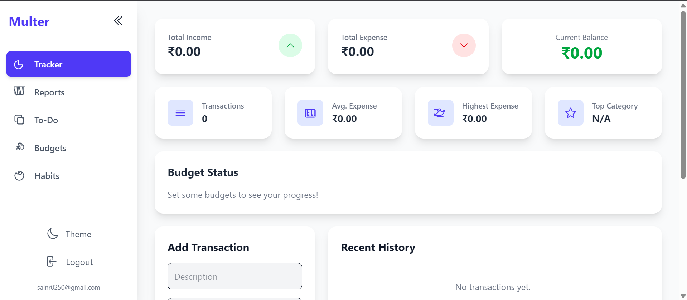
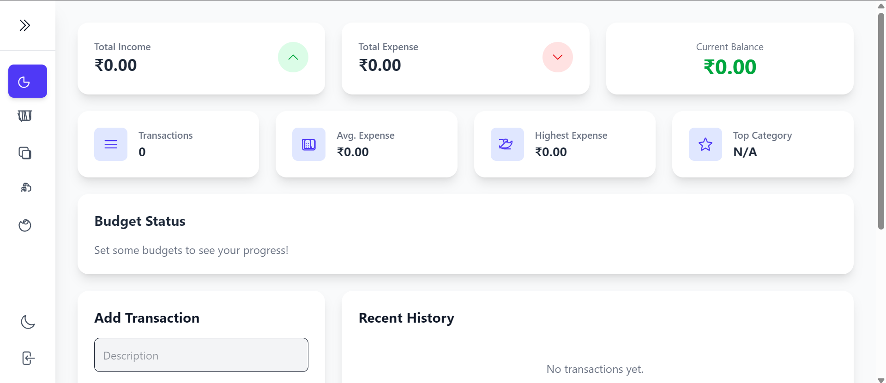

# Multer - The All-in-One Personal Dashboard

Multer is a modern, full-stack web application designed to be your central hub for personal productivity and financial management. Track expenses, manage budgets, organize tasks, build habits, and gain powerful insights into your financial life—all in one beautifully designed, responsive interface.

---

## 📸 Preview



---

## ✨ Key Features

### 💰 Financial Tracking
- **Expense & Income Logger**: Easily add transactions with categories, descriptions, and amounts.  
- **Budget Management**: Set monthly spending limits for categories (e.g., Food, Shopping) and visually track your progress.  
- **Main Dashboard**: Get an instant overview of your total income, expenses, and balance.  
- **Smart Stats**: View key metrics like average daily spending, highest single expense, and top spending category.  

### 📊 Advanced Financial Reports
- **Dynamic Reporting**: Generate beautiful, insightful reports for any date range.  
- **Spending Over Time**: Line chart to visualize daily spending trends.  
- **Period-Specific Analytics**: Detailed stats and category breakdown pie chart.  

### ✅ Productivity Tools
- **Intelligent To-Do List**: Add tasks with due dates and priority levels (Low, Medium, High).  
- **Habit Tracker**: Build positive routines and track streaks for motivation.  

### 🎨 Modern User Experience
- **Secure Authentication**: Firebase Authentication ensures private and secure data.  
- **Collapsible Sidebar**: Sleek navigation to maximize screen space.  
- **Fully Responsive**: Mobile-first design for all devices.  
- **Light & Dark Mode**: Switch themes with local storage preference.  

---

## 💻 Tech Stack
- **Frontend**: React (Hooks & Functional Components)  
- **Backend & Database**: Firebase (Firestore & Authentication)  
- **Styling**: Tailwind CSS  
- **Charting**: Recharts  
- **Deployment**: Vercel / Netlify / Firebase Hosting  

---

## 🚀 Getting Started

Follow these steps to set up and run the project locally.

### Prerequisites
- Node.js (v14+) & npm  
- Google account (for Firebase project setup)  

### 1. Clone the Repository
```bash
git clone https://github.com/Anos714/Multer-Web-App
cd multer-app
